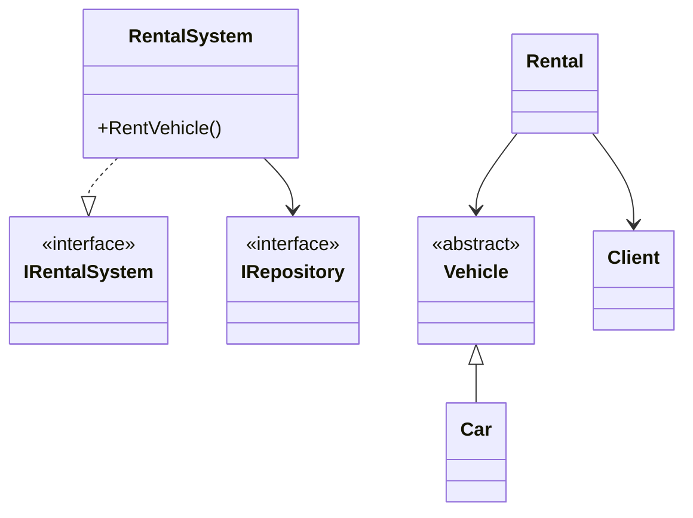

# Car Rental System (MVP)

A professional, console-based Car Rental Management System built with **C#** and **.NET 8**. This project demonstrates the application of **SOLID** principles, Clean Architecture, and essential Design Patterns.

## 🚀 Key Features

* **Vehicle Management**: Browse available vehicles and view full fleet status.
* **Client Management**: Register new clients, update existing data, and perform "Soft Deletes."
* **Rental Engine**: Real-time rental processing with automated price calculation and late fee logic.
* **Data Integrity**: Prevention of deleting clients or vehicles associated with active rentals.
* **Automated Testing**: Built-in integration tests to verify core business logic.

---

## 🏗️ Architecture & Design Patterns

This project is structured to separate concerns and ensure high maintainability:

### 1. SOLID Principles Applied
* **S (Single Responsibility)**: Each class has one job. For example, `ConsoleHelper` handles UI interaction, while `RentalSystem` handles business logic.
* **O (Open/Closed)**: The system is open for extension (e.g., adding a `Motorcycle` class) but closed for modification.
* **L (Liskov Substitution)**: Derived classes like `Car` can replace the base `Vehicle` without breaking the system.
* **I (Interface Segregation)**: Specific repositories (e.g., `IClientRepository`) ensure classes only depend on methods they actually use.
* **D (Dependency Inversion)**: High-level business logic depends on abstractions (Interfaces), not concrete implementations.

### 2. Design Patterns
* **Repository Pattern**: Abstracts data access, allowing easy switching from In-Memory storage to a Database in the future.
* **Factory Pattern**: Centralizes object creation logic in `VehicleFactory` and `ClientFactory`.
* **Facade Pattern**: The `RentalSystem` acts as a simplified interface to the complex underlying logic of repositories.

### 3. Professional Practices
* **Soft Delete**: Instead of physical deletion, entities are marked with an `IsDeleted` flag to preserve historical rental data.
* **Custom Exceptions**: Domain-specific errors (e.g., `RentalDomainException`) are used to handle business rule violations.

---

## 📂 Project Structure

* **/Models**: Domain entities (`Vehicle`, `Car`, `Client`, `Rental`).
* **/Interfaces**: Abstractions for repositories and services.
* **/Infrastructure**: Data access implementation (In-Memory storage).
* **/Services**: Core business logic and orchestration.
* **/UI**: Console interface and helpers for user interaction.

---

## 🛠️ Getting Started

### Prerequisites
* [.NET 8.0 SDK](https://dotnet.microsoft.com/download/dotnet/8.0)

### Installation & Run
1. Clone the repository:
   ```bash
   git clone [https://github.com/SoV3n04ek/car-rental-system.git](https://github.com/SoV3n04ek/car-rental-system.git)
```

2. Navigate to the project folder:
```bash
cd car-rental-system

```


3. Run the application:
```bash
dotnet run
```


---

## 📊 System Overview (UML)

